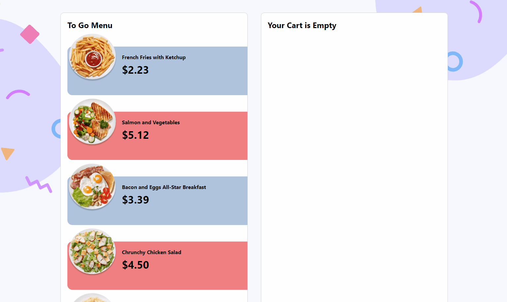

# eCommerce-component based on the Advent of JS & CSS challenge, Day 2

### The Challenge
My goal was building the site with React, JavaScript, HTML, and CSS from scratch. Later, I hope to rebuild it with TypeScript. The challenge is developeed a eCommerce site based on a design that 
1. Add plate meals to a cart
2. Increase and decrease plate meals, including count and price total, in the cart

An additional personal challenge was to go beyond the given design and make it mobile responsive. 

### GIFs of app in use

### How to run in development(Windows with NPM)
1. Clone the repo.
2. Open a terminal and navigate directory
3. Type npm install
4. When finish, type npm start

### Built with
- React
- Semantic HTML5 markup
- CSS custom properties
- CSS Flexbox
- Javascript 

## Author
- Website - [JC Smiley](https://www.jcsmileyjr.com)
- Twitter - [@JCSmiley4](https://twitter.com/JCSmiley4)
- LinkedIn - [jcsmileyjr](https://www.linkedin.com/in/jcsmileyjr/)